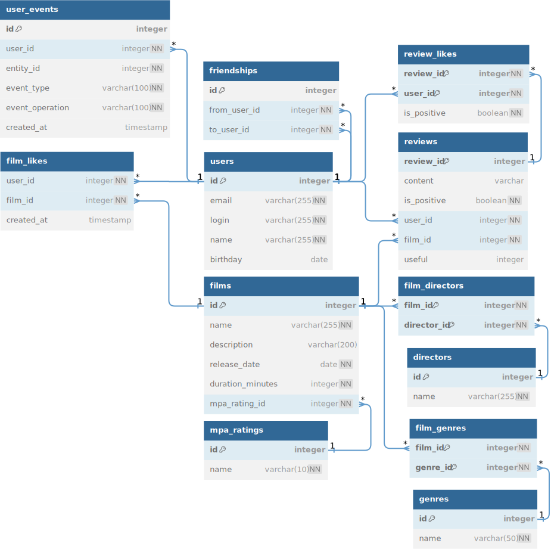

<h1 align="center">Filmorate</h1>

    
<a href="https://github.com/PavelSpectr/java-filmorate"><strong>GIT-Project</strong></a>
     
    

    <h3 align="center">Yandex Practicum Team:</h3>

    Евгения Вершинина
     
    Михаил Хахутов
     
    Алексей Кириничный
     
    Андрей Курочкин
     
    Павел Спектр
     
  

<h3 align="center">Features:</h3>

- Поиск по названию фильмов; 
- Общие фильмы; 
- Рекомендации; 
- Лента событий; 
- Фильмы по режиссёрам; 
- Популярные фильмы; 
- Удаление фильмов и пользователей. 

<h1 align="center">Схема базы данных</h1>

